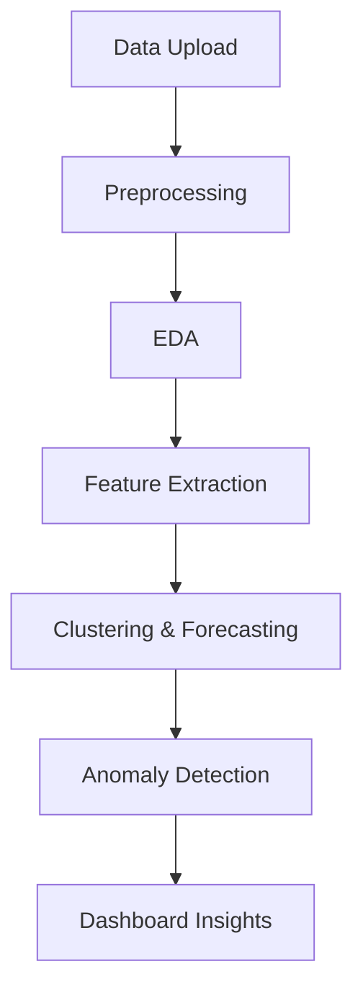

# 🧠 FitPulse: Health Anomaly Detection from Fitness Devices

<p align="center">
  🚀 Data Analytics • 🤖 Machine Learning • 📊 Interactive Dashboard  
</p>

<p align="center">
  
  
  
  
</p>

---

## 📌 Project Overview

FitPulse is an end-to-end **health analytics system** that processes wearable fitness data to detect anomalies and provide actionable insights.

It uses **machine learning, time-series analysis, and interactive dashboards** to identify abnormal health patterns efficiently.

---

## 🎯 Objectives

* 📊 Analyze fitness data efficiently
* ⚠ Detect anomalies in health patterns
* 📈 Perform time-series forecasting
* 🧠 Apply clustering for behavior analysis
* 🖥 Build an interactive dashboard

---

## 🧩 Project Pipeline



---

## 🏗 Project Structure

### 🔹 Milestone 1: Data Processing & EDA

* Data Upload
* Null Value Handling
* Preprocessing
* Data Preview
* Exploratory Data Analysis (EDA)
* Trend Visualization

---

### 🔹 Milestone 2: Advanced Analytics

* Feature Extraction (**TSFresh**)
* Forecasting (**Prophet**)
* Clustering:

  * KMeans
  * DBSCAN
* Dimensionality Reduction:

  * PCA
  * t-SNE

---

### 🔹 Milestone 3: Anomaly Detection

* Model Residual Analysis
* Threshold-based Detection
* Cluster-based Outliers
* Visualization with highlighted anomalies

---

### 🔹 Milestone 4: Interactive Dashboard

* 📊 Streamlit-based UI
* 📅 Date & range filters (7/30 days)
* 📈 Dynamic charts
* 🤖 AI anomaly detection (Isolation Forest)
* 📤 Export results (CSV)

---

## 📊 Tech Stack

| Category            | Tools              |
| ------------------- | ------------------ |
| Language            | Python             |
| UI                  | Streamlit          |
| Data Processing     | Pandas, NumPy      |
| Visualization       | Plotly, Matplotlib |
| ML                  | Scikit-learn       |
| Time-Series         | Prophet            |
| Feature Engineering | TSFresh            |

---

## 📁 Dataset

Includes:

* ❤️ Heart Rate Data
* 🚶 Daily Activity
* 😴 Sleep Data
* 🔥 Calories & Intensity

---

## 📸 Screenshots

> Add your screenshots inside `/screenshots` folder

| Dashboard                               | Clustering                             | Anomaly Detection                   |
| --------------------------------------- | -------------------------------------- | ----------------------------------- |
|  |  |  |

---

## 🚀 Installation & Setup

### 1️⃣ Clone Repository

```bash
git clone https://github.com/WedangChoudhay/FitPulse-Health-Anomaly-Detection-from-Fitness-Devices.git
cd FitPulse-Health-Anomaly-Detection-from-Fitness-Devices
```

### 2️⃣ Create Virtual Environment

```bash
python -m venv fitpulse
```

### 3️⃣ Activate Environment

```bash
fitpulse\Scripts\activate
```

### 4️⃣ Install Dependencies

```bash
pip install -r requirements.txt
```

### 5️⃣ Run App

```bash
streamlit run main_app.py
```

---

## 🌟 Key Features

* 🔥 Interactive dashboard
* ⚡ Real-time filtering
* 🤖 ML-based anomaly detection
* 📊 Advanced visualizations
* 🔍 Behavioral clustering
* 📈 Forecasting insights

---

## 💡 Future Enhancements

* 📡 Real-time wearable integration
* 📱 Mobile application
* ☁ Cloud deployment
* 🤖 Advanced AI anomaly detection

---

## ⭐ Conclusion

FitPulse demonstrates how **data analytics and machine learning** can be used for **early health anomaly detection**, enabling smarter and proactive healthcare insights.

---

<p align="center">
  ⭐ If you like this project, give it a star!
</p>
